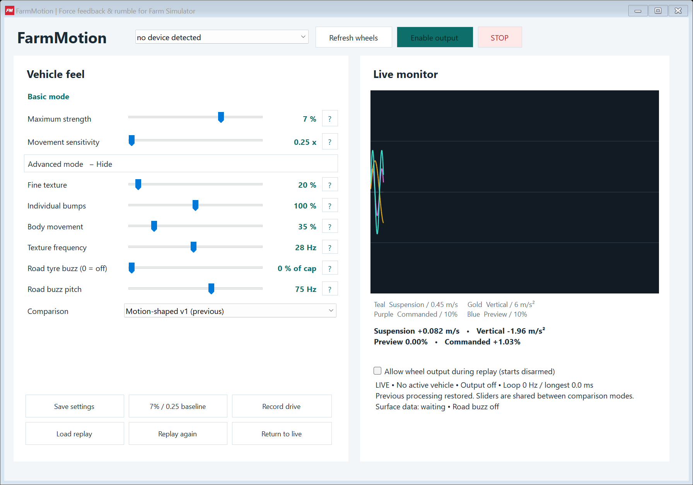

<p align="center"></p>

# FarmMotion | Force feedback & rumble for Farm Simulator

A small Windows companion that turns **Farming Simulator 25** vehicle movement into steering-wheel feedback: suspension bumps, body movement, fine texture and optional road tyre buzz.

**0.1.0 preview · Windows x64 · Single-player · GPL-2.0-only**



## Download and install

Download the portable Windows ZIP from [Releases](https://github.com/wesleygarnett/FarmMotion/releases). While the repository is private, GitHub access is required.

1. Extract `FarmMotion-v0.1.0-win-x64.zip` into a writable folder.
2. With FS25 closed, copy the included **`FS25_FarmMotionTelemetry.zip`** to `Documents\My Games\FarmingSimulator2025\mods`. Keep this inner ZIP zipped. If your Documents folder is redirected, use the mods folder beside your game's `log.txt`. Keep a copy of an older mod before replacing it.
3. Launch **`FarmMotionUI.exe`**. Select your wheel, or connect it and click **Refresh wheels**.
4. Start FS25, enable **FarmMotion Telemetry** for your save, and enter a vehicle. Check that packet counts increase.
5. Start with low strength, click **Enable output**, then return to the game.

Requires **.NET Framework 4.8** and a Windows DirectInput wheel supporting constant-force effects. MOZA R3 is the initial hardware target; other wheels are unverified. No installer, administrator access, SimHub or proprietary wheel SDK is needed. Run the game and app as the same Windows user.

Keep each `.exe.config` file beside its executable: these enable per-monitor DPI scaling. The binaries are currently unsigned. Release checksums are in `SHA256SUMS.txt`; verify a download with `Get-FileHash -Algorithm SHA256 <file>`.

## Everyday controls

**Basic mode** shows the two main controls:

| Control | Effect |
|---|---|
| Maximum strength | Caps total force at 0–10% of driver full-scale. |
| Movement sensitivity | Makes incoming vehicle movement feel calmer or more pronounced. |

Click **Advanced mode + Show all sliders** to reveal fine texture, individual bumps, body movement, texture frequency, road tyre buzz, road buzz pitch and the comparison selector. Every slider has a **?** explanation. Hiding Advanced preserves its values.

**STOP** disables output and replay. **Escape while the dashboard is focused** disables output. Live output is gated to FS25 being the foreground application. Output always starts disarmed and is never saved as enabled.

**Save settings** and normal window closure save tuning to `%LOCALAPPDATA%\FarmMotion\settings.json`. The baseline button resets only strength and sensitivity to 7% / 0.25x. Updates preserve saved tuning.

## Feedback and comparison

- **Motion-shaped v1:** signed suspension bumps, slower body motion, and movement-driven texture.
- **Motion-shaped v2:** per-wheel filtering, layered texture and softer peak compression.
- **Original 18 Hz:** the original movement-driven vibration for comparison.

Comparison modes share settings and reset accumulated filters when switched. Existing settings do not silently move to a different mode.

Road tyre buzz is separate from movement texture. It requires eligible agricultural tyres, rotation, travel speed and the game's broad road-class ground contact. Its 50–90 Hz pitch is a commanded software carrier; actual reproduction depends on the output loop and wheel driver. The road amount is a percentage of the selected strength cap, not driver full-scale. Road buzz uses remaining force headroom so larger bumps retain priority. This is not a precise asphalt-material detector.

The graph shows incoming movement, a force preview, and commanded force—not measured wheel torque. This app synthesizes tactile movement feedback; it is not Logitech TrueForce or a physical steering-rack simulation.

## Record and replay

**Record drive** saves a short `.fmr` telemetry recording. **Stop recording** finishes it. **Load replay** and **Replay again** start disarmed. To send replay output to a wheel, explicitly check **Allow wheel output during replay**, enable output, and keep the dashboard focused. **Return to live** disarms again.

Recordings are local and never uploaded. Files larger than 64 MB are rejected. Recording uses a bounded queue; storage that cannot keep up stops recording with an error instead of accumulating unlimited data.

## Troubleshooting

| Symptom | Check |
|---|---|
| no device detected | Check power, USB and the wheel driver, then Refresh wheels. Detection only lists attached force-feedback devices. |
| Packets stay at zero | Enable the mod for the save; ensure game and app run as the same user. If it happened after restarting the companion, leave the app open and save/restart FS25. |
| Packets arrive but output is quiet | Enter a vehicle, close menus, enable output, focus FS25 and check nonzero strength. |
| Road buzz is absent | Install the bundled mod; check road amount, tyre type, travel speed and the surface status line. |
| Text is blurry | Keep the supplied config files beside the executables and avoid a Windows compatibility override that forces bitmap scaling. |
| No wheel forces during replay | Allow replay output, enable output separately, and keep the dashboard focused. |

Do not assume the displayed loop frequency proves physical wheel response. See the [review and known limitations](docs/REVIEW.md).

## Build and test

On Windows x64 with Windows PowerShell and .NET Framework 4.8:

```powershell
powershell -NoProfile -ExecutionPolicy Bypass -File .\build.ps1 -RunUiTests
```

Outputs go to `dist/build`; use `-OutputDirectory PATH` to choose another folder. The build uses the framework compiler already installed with Windows, treats warnings as errors, and runs the hardware-free suite. No NuGet restore or .NET SDK is required.

UI checks use a separate test-instance mutex, mock data and no hardware output. They verify Basic/Advanced visibility, the empty-device state, comparison switching, independent road pitch and PerMonitorV2 awareness, then save screenshots beside the test executable.

`FarmMotion.exe --self-test` runs the checks; `--list-wheels` lists devices and `--monitor` runs console diagnostics. Everyday use should launch `FarmMotionUI.exe`.

Run `release.ps1` from a committed checkout to produce the portable ZIP, mod ZIP, committed-source ZIP and checksums. See [contributing](CONTRIBUTING.md), [release procedure](docs/RELEASING.md), [changelog](CHANGELOG.md), and [security](SECURITY.md).

## License and attribution

GPL-2.0-only. The Lua exporter is adapted from Mhytee's Trueforce-For-All v0.2.6; attribution and upstream sources are in [THIRD_PARTY.md](THIRD_PARTY.md). License and source accompany releases. FarmMotion is an independent project, not affiliated with GIANTS Software, MOZA or Adobe.
