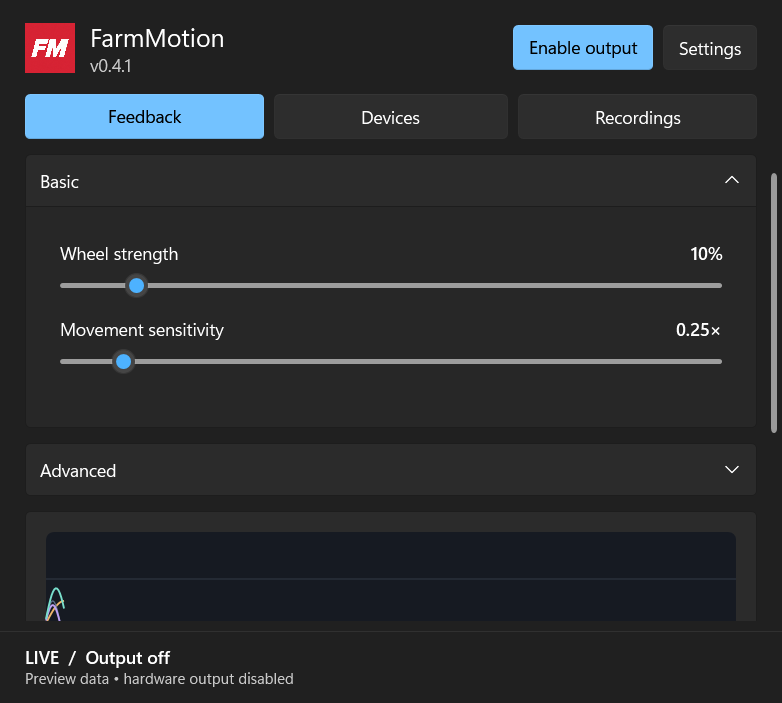

# FarmMotion

Ever wish farm simulator had force feedback on steering wheels? This mod fixes that. Feel every bump in the road and field, and customize how strong you want to feel it.

For **Farming Simulator 25 on Windows**. Tested on MOZA R3. Beta release.

## Downloads

| Download | What you need |
|---|---|
| **[Windows app — v0.4.1](https://github.com/wesleygarnett/FarmMotion/releases/download/v0.4.1/FarmMotion-v0.4.1-win-x64.zip)** | Contains **FarmMotion.exe** and everything it needs. Extract this ZIP. |
| **[FS25 mod — v1.0.0.2](https://github.com/wesleygarnett/FarmMotion/releases/download/v0.4.1/FS25_FarmMotionTelemetry.zip)** | Copy this ZIP into your FS25 mods folder. **Do not extract it.** |

[Release notes and checksums](https://github.com/wesleygarnett/FarmMotion/releases/tag/v0.4.1)

Public beta.

## Install

1. **Download both files above.** Extract the Windows app ZIP into a folder you want to keep.
2. **Close FS25.** Copy `FS25_FarmMotionTelemetry.zip` into `Documents\My Games\FarmingSimulator2025\mods`, replacing the old copy if installed.
3. **Run FarmMotion.exe** from the extracted app folder. On **Devices**, select your wheel or controller.
4. **Start FS25**, enable **FarmMotion Telemetry** for your save, and enter a vehicle.

Keep the app's files together. Output starts enabled and waits for active gameplay. New settings default to **10% wheel strength, 0.25× sensitivity, 10% bumps, 10% body movement, and 100% fine texture**; existing tuning is preserved. Adjust **Basic → Wheel strength** before driving, and use **Disable output** to stop feedback.

Requires Windows x64 and .NET Framework 4.8. The app and mod both need to be running for feedback.

## Updating from 0.4.0 or earlier

Download and extract the new app ZIP into a **fresh folder**, close the old app, and run **FarmMotion.exe**. Earlier in-app updaters require the old two-executable layout and cannot install this package. Your saved tuning and device choices carry over automatically. Update any shortcuts; if Start with Windows was enabled, toggle it off and on in the new app to update its path. Future updates use the single-executable layout.

## Controls

- **Feedback:** Basic strength/sensitivity; Advanced effects, frequencies and Solo.
- **Devices:** independent wheel and controller output, with separate rumble strength.
- **Recordings:** record and replay telemetry to compare tuning.
- **Settings:** start with Windows and check for updates.

## Compatibility and known limitations

MOZA R3 wheel feedback has been tested during development. Xbox, DualShock, DualSense and other SDL-compatible controllers use ordinary rumble; device and connection-specific compatibility still needs tester confirmation. No adaptive triggers or advanced haptics.

App v0.4.1 and mod v1.0.0.2 add restart detection. Automated checks pass; reconnecting after an app update while FS25 stays open still needs live validation. Install the updated mod with FS25 closed once. The default FS25 profile location is supported; see the user guide for custom profiles.

The Windows app is unsigned. This project is independent of GIANTS Software and is not ModHub approved.

## More information

[User guide](docs/USER_GUIDE.md) · [Changelog](CHANGELOG.md) · [Build instructions](CONTRIBUTING.md) · [License](LICENSE)

The mod passes all 15 GIANTS TestRunner modules. Live multiplayer, hardware compatibility and ModHub submission artwork still need validation; this is not a ModHub-approved release. [Test details](docs/modhub-test-2026-09-21/FIXES.md)
